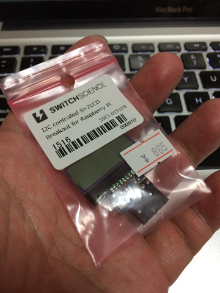
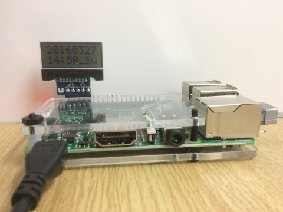

# Shell script to display string on AQM0802
会社帰りに千石電商で800円ほどの小さな液晶を買いました。Raspberry PiとI2Cで繋がるタイプのもので、裏側にAQM0802A-RN-GBWと印字されていました。  
  
[スイッチサイエンスのブログ](http://mag.switch-science.com/2013/07/30/use-i2c-lcd-brakeout-board-on-raspberry-pi/)に載っていた使い方を参考に書いたシェルスクリプトです。  

## Usage | 使い方
ターミナルでスクリプトを実行します。  
- 引数なし  
 入力プロンプトに指定した内容を液晶に表示します。  
- 引数あり  
 指定された引数の内容を液晶に表示します。  

液晶の仕様が８桁２行なので、これを超えた分は表示されません。スクロール処理などはありません。  

- 動作確認機種：RASPBERRY PI 2 MODEL B  
- 動作確認OS：raspbian-jessie-lite / Firmware 4.1.xx  
- 使用ツール：i2c-tools  
- 対象モジュール：AQM0802  

## Mind the special characters | 特殊文字の扱い
なぜか!が連続すると正しい文字列を表示しないなと思ったら、これって特殊文字でしたね。日付表示のコードを見ていて気がつきました。bashの特殊文字を表示したい時は\でのエスケープを忘れずに。  

## License
This script has released under the MIT license.  
[http://opensource.org/licenses/MIT](http://opensource.org/licenses/MIT)  

## One more thing...
今日の日付を表示させたければコマンド名をtodayに、合わせて時刻も表示させたければgettimeという名前にして実行してください。gettimeをcronで毎分実行させるとデジタル時計のできあがり。  
  
